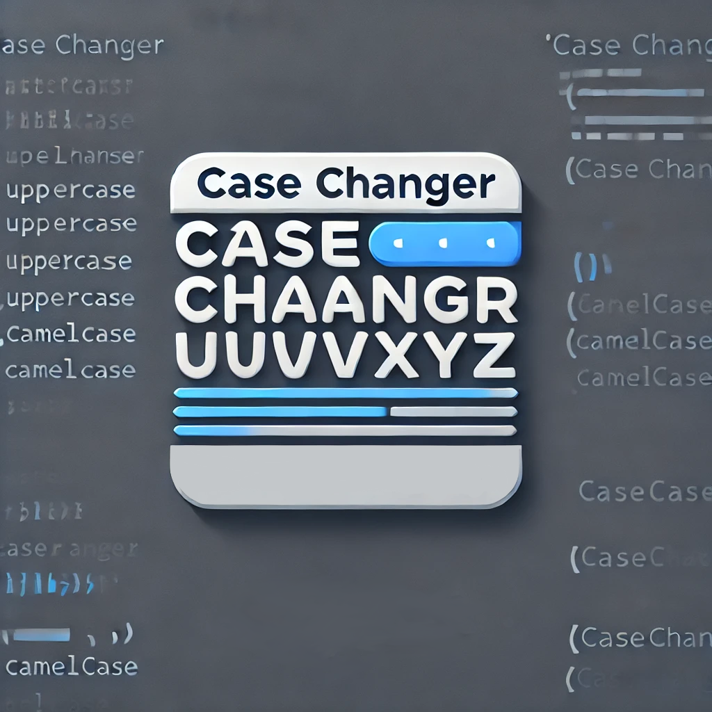

# CaseChanger

CaseChanger is a Visual Studio Code extension that allows you to quickly convert text between different case styles. With CaseChanger, you can easily switch between snake_case, camelCase, PascalCase, and kebab-case formats, making it convenient when working with different naming conventions in your code.

## Features

- Convert text selections or entire documents to various case styles.
- Supports snake_case, camelCase, PascalCase, and kebab-case.
- Configurable keyboard shortcuts for quick conversions.
- Context menu to change case when text selected

## Installation

1. Launch Visual Studio Code.
2. Go to the Extensions view (Ctrl+Shift+X).
3. Search for "CaseChanger" by "jerky676".
4. Click on the "Install" button to install the extension.
5. Restart Visual Studio Code (if required).

## Usage

1. Select the text you want to convert or place the cursor within the word you want to change.
2. Right-click and choose "Change Case" from the context menu, or use the keyboard shortcut.
3. Select the desired case style from the options provided.
4. The selected text or word will be converted to the chosen case style.

## Configuration

You can customize the keyboard shortcuts used by CaseChanger by following these steps:

1. Open the Keyboard Shortcuts editor in Visual Studio Code (File > Preferences > Keyboard Shortcuts or Ctrl+K Ctrl+S).
2. Search for "casechanger.convertCase" in the search bar.
3. Click on the pencil icon to the left of the shortcut you want to change.
4. Enter your preferred keyboard shortcut combination.
5. Save the changes.

## Contributing

Contributions are welcome! If you encounter any issues or have suggestions for improvements, please feel free to open an issue or submit a pull request on the [GitHub repository](https://github.com/jerky676/CaseChanger).

## License

This extension is licensed under the [MIT License](LICENSE).

---

If you find this extension helpful, consider leaving a ⭐️ on the [GitHub repository](https://github.com/jerky676/CaseChanger). Happy coding!